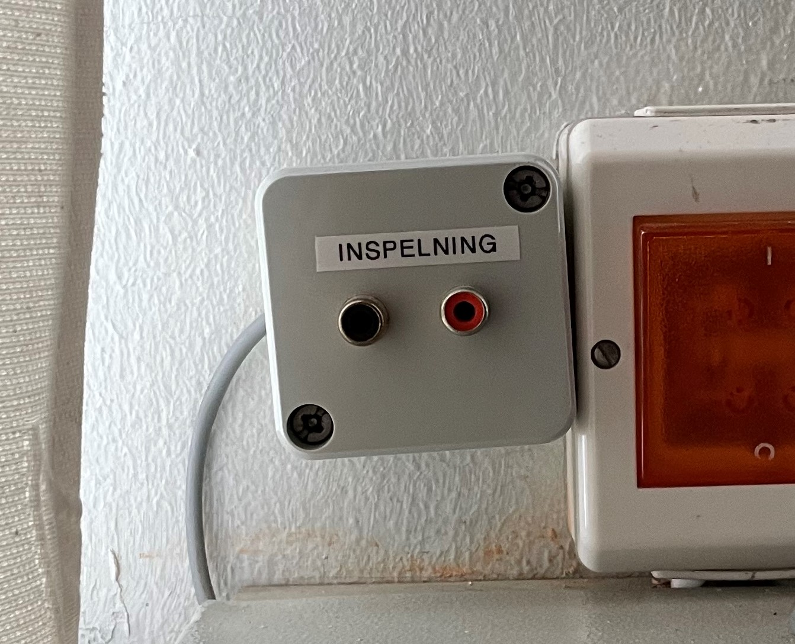
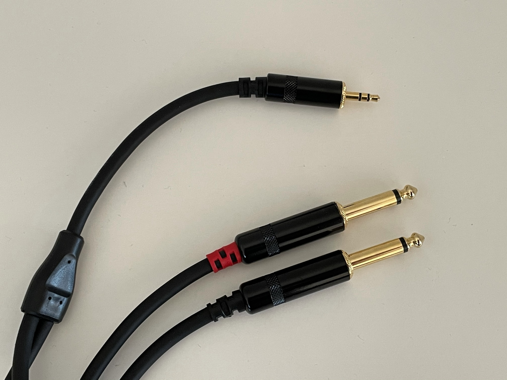
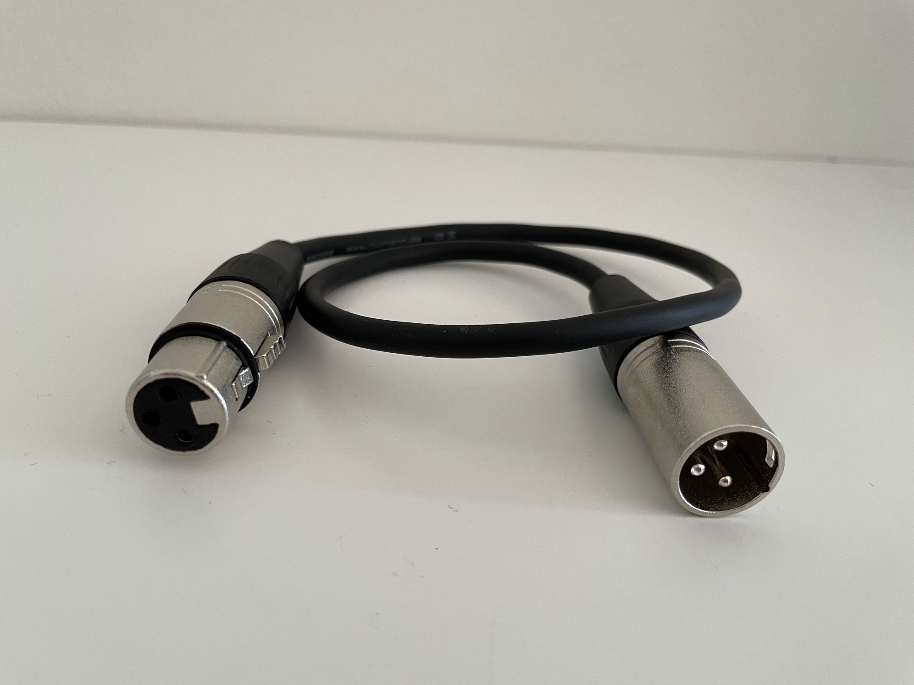
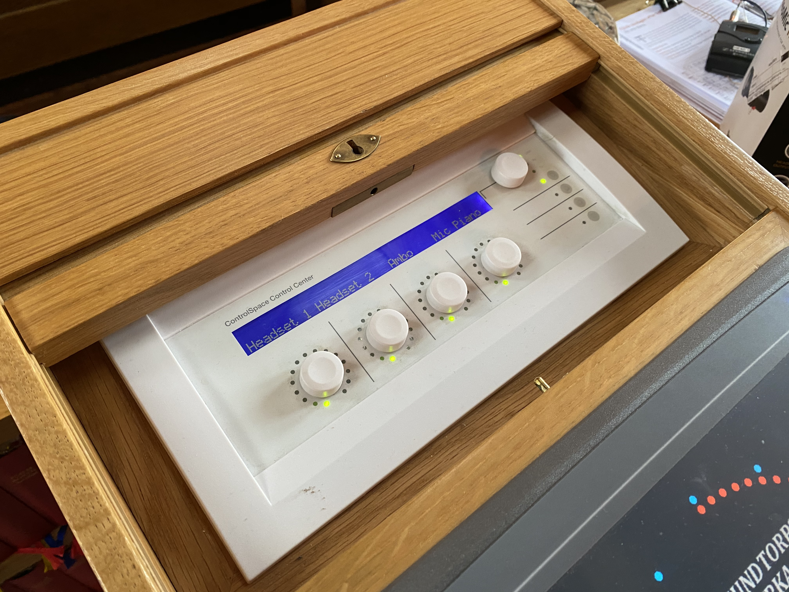
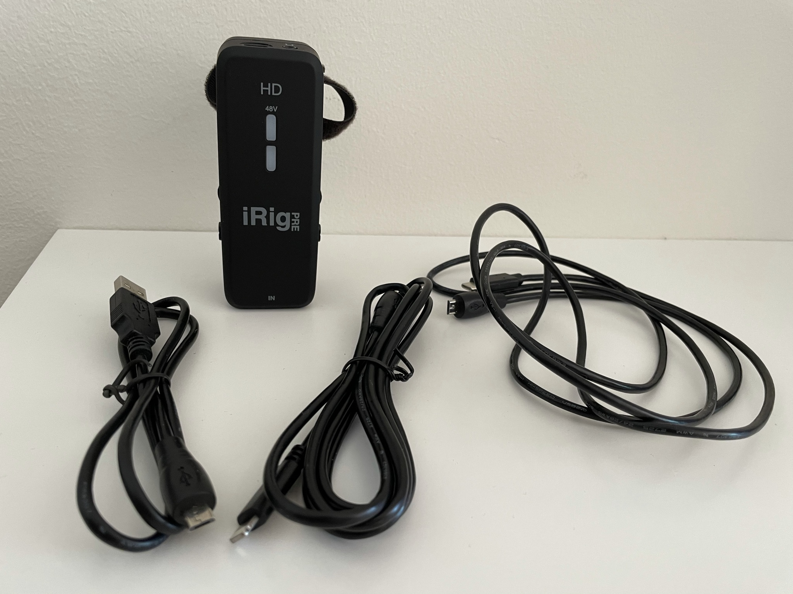
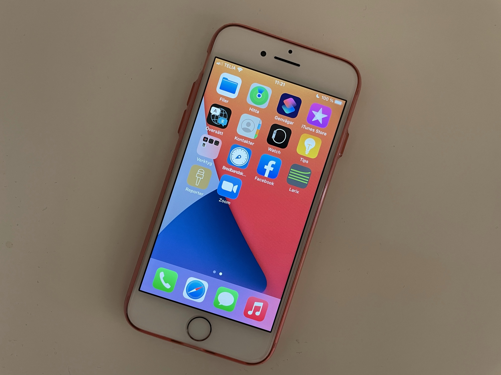
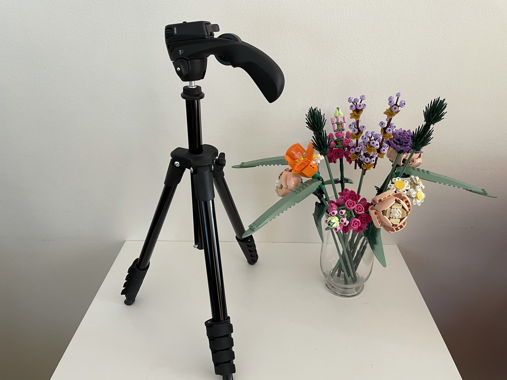
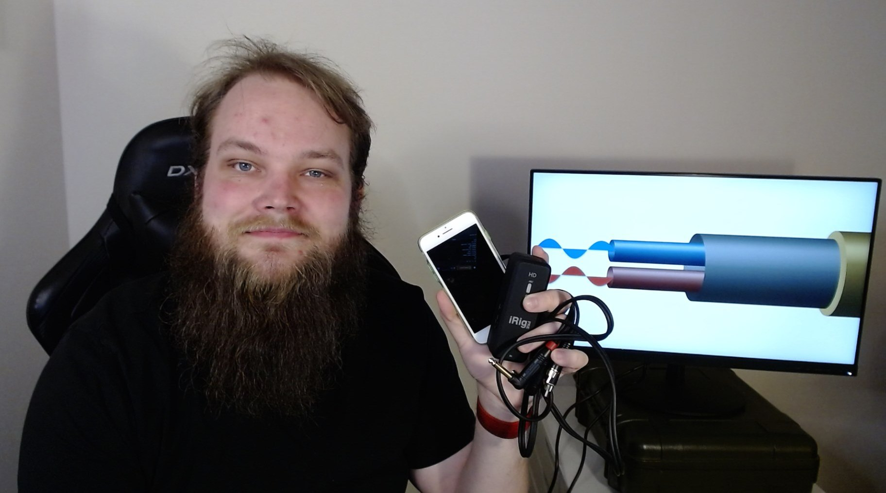

## Finna, fixa och fånga ljudet

I de flesta kyrkor och samlingslokaler använder vi oss av en ljudanläggning med mikrofoner och högtalare för att alla som är på plats ska höra vad som sägs. När vi ska sända live så kan vi låna samma mikrofoner genom att koppla in oss på den befintliga ljudanläggningen. Om vi gör det på rätt sätt kan vaktmästaren justera ljudet som vanligt – så länge det låter bra i rummet kommer det låta bra i sändningen.

### Finna ljudet

För att kunna plocka ljudet från ljudanläggningen behöver vi hitta en utgång. En del ljudanläggningar har utgångar tydligt uppmärkta, ofta med ”inspelning” eller ”line out”. I andra fall kan det krävas ytterligare installation och konfiguration av en ljudfirma. För det mesta räcker det att hitta rätt utgång och köpa in rätt sladdar.

Leta efter någon av dessa tre när du ska finna ljudet:

#### RCA

Den känner du igen från din gamla stereo, eller hur? Kallas RCA eller phono och är den vanligaste kontakten för både ljud ut och ljud in.

#### Tele

Den klassiska lilla telekontakten känner du igen från dina hörlurar. Tele kommer i en liten variant (3,5 mm) och en stor variant (6,3 mm). Vissa kallar den lilla för mini-tele och den stora bara för tele. Ditt mixerbord har kanske en ljud ut med telekontakter? Eller ett hörlursuttag tänkt till ljudteknikerns medhörning? Där kan vi koppla in oss!

En telekontakt kommer med olika många poler. En kontakt med bara en ring är en mono-kontakt, medan en med två ringar är en stereo-kontakt.

#### XLR

XLR-kontakten känner du nog igen från alla mikrofoner och mikrofonkablar. Det kan hända att ditt mixerbord har en ledig XLR-utgång, i så fall kan du använda den.

#### Hopplösa fall

Har ni en sån här idiotsäker ljudanläggning, till exempel från Bose eller Creston? Då gör du bäst i att ta kontakt med firman som installerade den och be dem installera en ljudutgång. Säg att du vill ha en "balanserad XLR mono-utgång" för att kunna koppla in din inspelningsutrustning så förstår de precis vad du menar.

### Fixa ljudet

Om vi hittar en utgång med ljud på så är ljudsignalen antingen balanserad eller obalanserad. Väldigt förenklat kan vi säga att om ljudanläggningen har en XLR-kontakt som utgång så är signalen sannolikt balanserad. Ibland står det i anslutning kontakten om den är balanserad eller obalanserad.

En balanserad signal är inte lika känslig för störningar som en obalanserad signal, och detta är viktigt vid längre avstånd än några meter. Om ljudanläggningen ger oss en obalanserad signal så kan vi enkelt balansera den med hjälp av en DI-box. DI-box kallas också ibland för linebox eller symmetrilåda. En DI-box kostar ungefär 200-500 kr.

### Fånga ljudet

Nu när du funnit och fixat ljudet är det dags att fånga det, alltså få in det i din telefon. Det gör du enklast med ett ljudkort. Min favorit är _IK Multimedia iRig Pre HD_. Kostar runt tusenlappen och har ett XLR-uttag för ljud in, en hörlurskontakt för medhörning och en ratt för att ställa ljudnivån. Funkar utan installation med iPhone, Android-telefoner med USB-C, Windows-datorer och Mac-datorer. Kostar runt tusenlappen men är ofta slut i lager, så slå ett öga på [Prisjakt](https://www.prisjakt.nu/produkt.php?p=4619461) vetja. Ring mig om det krisar, jag har ofta några extra hemma.

## Bilden

Jag rekommenderar att du gör dina sändningar med en helt vanlig gammal iPhone. Eftersom sändningen ändå kommer ske komprimerat så finns det ingen anledning att bränna på med senaste modellen utan en iPhone 7 eller senare räcker gott. Nuförtiden kryllar det ju av begagnatbutiker på webben där du kan få en begagnad iPhone i gott skick för några tusenlappar. Eller så har ni kanske en över redan?

### Uppkoppling via Wifi

Om du har Wifi där du ska sända använder du med fördel det. Du behöver ungefär 2 MBit/s uppströms och en svarstid på mindre än 30 ms. Typ.

I många kyrkor finns Svenska kyrkans standard-Wifi. Där kan du använda antingen "Svenskakyrkan-pda" (pda-nätet) eller "Svenskakyrkan-guest" (gästnätet). Pda-nätet kräver att telefonen ägs av er och är registrerad i Beställningsportalen (BAS). Kapaciteten på nätet hänger ihop med vad som är indraget i byggnaden, ofta 10 MBit/s både uppströms och nedströms.

Gästnätet kan du ansluta till genom att varje gång godkänna villkoren eller genom att bli godkänd för 30 dagar av någon med en @svenskakyrkan.se-adress. Under konventionell arbetstid är gästnätet begränsat till 4 Mbit/s uppströms och nedströms. Kvällar och helger är det som med pda-nätet att det hänger på vad som är indraget i byggnaden.

Saknas det Wifi men finns trådad anslutning kan du koppla in en egen trådlös accesspunkt. Den måste då sättas i ett uttag som tillhör kyrkans gästnät, driftnät eller ett nät som ligger helt utanför. Att koppla in en egen accesspunkt till kyrknätet innebär en stor säkerhetsrisk för hela kyrkan och är därför strängt förbjudet! Kolla med Kanslistöd eller ditt stiftskansli om du är osäker.

### Uppkoppling via mobilnätet

Om du inte har tillgång till Wifi sätter du ett simkort i telefonen. Kolla med er operatör, jag är övertygad om att ni kan skaffa det som innan kallades "tvillingkort" till ett förmånligt pris.

Om er operatör inte har bra täckning där du ska sända så kolla runt bland kollegornas privata telefoner hur deras täckning är. I Sverige finns tre 4G-nät: Telenor/Tele2 (har gemensamt 4G-nät), Telia och Tre. Alla operatörer erbjuder billiga abonnemang (Vimla/Comviq/Halebop/Hallon) som räcker utmärkt förutsatt att täckningen är god.

### Kamerastativ

Du har säkert redan ett kamerastativ. Annars vill jag tipsa om "Compact Action" från Manfrotto som blivit en personlig favorit. Flexibel kulled, står hyfsat stabilt, enkelt att bära med sig och inte så dyrt. Till ditt stativ behöver du också en hållare till telefonen. Sådana brukar finnas på samma ställe du köper kamerastativet ifrån. Ta inte de allra billigaste, de brukar kännas plastiga och skapar en onödig oro när du har så mycket annat tänka på.

## Appen

Jag gör alla mina sändningar med appen Larix Broadcaster från Softvelum. Den är gratis och finns till både iOS och Android. Och den är toppen!

På intranätet står faktiskt allt du behöver veta om appen och hur du ställer in den:

[https://svkyrkan.sharepoint.com/sites/kornet-externwebb/SitePages/Sanda-video-live-fran-telefon.aspx](https://svkyrkan.sharepoint.com/sites/kornet-externwebb/SitePages/Sanda-video-live-fran-telefon.aspx)

På intranätet finns också en artikel om hur du anpassar webbplatsen bäst:

[https://svkyrkan.sharepoint.com/sites/kornet-externwebb/SitePages/S%C3%A4nda-video-live-p%C3%A5-svenskakyrkan.se.aspx](https://svkyrkan.sharepoint.com/sites/kornet-externwebb/SitePages/S%C3%A4nda-video-live-p%C3%A5-svenskakyrkan.se.aspx)

### Andra appar

Det är faktiskt så fiffigt att ljudkortet funkar med precis alla appar på telefonen, eftersom telefonen tror att det är ett vanligt "headset" som är inkopplat. Det betyder att du kan sända med Facebook, Youtube, Zoom och så vidare. Till och med Facebook Messenger, allt funkar!

## Inköpslista

Alla mina föreslagna prylar finns hos Thomann. Utom en, kamerastativet har jag köpt från Scandinavian Photo. Tänk på att komplettera med de sladdar du behöver.

- [Ljudkort](https://www.thomann.de/se/ik_multimedia_irig_pre_hd.htm)
- [Symmetrilåda (DI-box)](https://www.thomann.de/se/behringer_ultradi_400p.htm)
- [Stativ](https://www.scandinavianphoto.se/manfrotto/stativkit-compact-action-svart-1013537)
- [Mobilklämma](https://www.thomann.de/se/manfrotto_mcpixi_smartphone_clamp.htm)

# Det var nog allt?

Tror jag. Säg till om du undrar något. Som av en händelse erbjuder jag en timmes digital kurs med rubriken "Gudstjänst digitalt – sändning utan mellanhand" som du gärna får hyra in. Här är några kommentarer från när jag höll kurs på uppdrag av stiftskansliet i Växjö:

> Jättebra Alex, lagom nivå. Jag inser att vi ibland varit för avancerade hos oss. 👏
> _Henrik_

> Jättebra hands-on-genomgång för alla som vill sända live.
> _Renée_

> Superbra! Hade definitivt varit värt att spela in! Du var ju supercool!
> _Kikki_

> Många bra tips! Det märks att du kan mycket om detta!
> _Tina_

> Det var superbra, och man kände sig helt... ompysslad och redo!
> _Görel_

---

### Licens

Denna artikel är publicerad under [Creative Commons CC BY-NC-SA 4.0-licens](http://creativecommons.org/licenses/by-nc-sa/4.0/?ref=chooser-v1). Det innebär att du får kopiera, bearbeta och vidaredistribuera materialet så länge du använder samma licens som jag och du hänvisar tillbaka hit. Alla bilder är tagna av mig. Jag blir jätteglad om du skickar ett mail till mig om du gjort en egen vidaredistribution.

#### Medförfattare

- Under rubriken "Uppkoppling via Wifi" har Daniel Rubenson på stiftskansliet i Lund bidragit med ett par textstycken som jag har bearbetat. Tack Daniel!

#### Ändringslogg

##### 2021-03-14

Första publicering

##### 2021-03-16

Utökade infon om uppkoppling via wifi/4G. La till ett stycke om att sända med andra appar än Larix. La till en plats för medförfattare och ändringslogg. Ändrade lite stavfel och justerade några meningar.

#### Prenumerera på ändringar

Vill du att jag säger till när jag ändrar något i guiden? Skicka ett mail till mig så lägger jag till dig på min sändlista.
